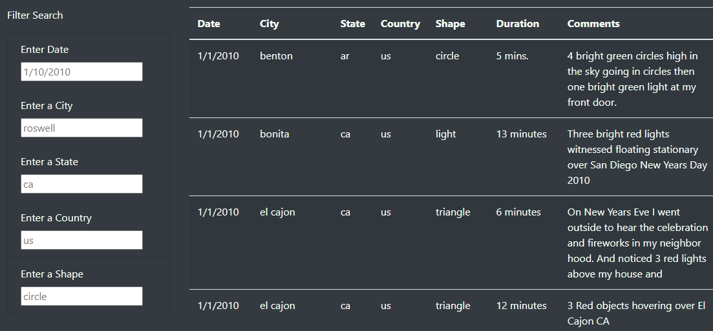
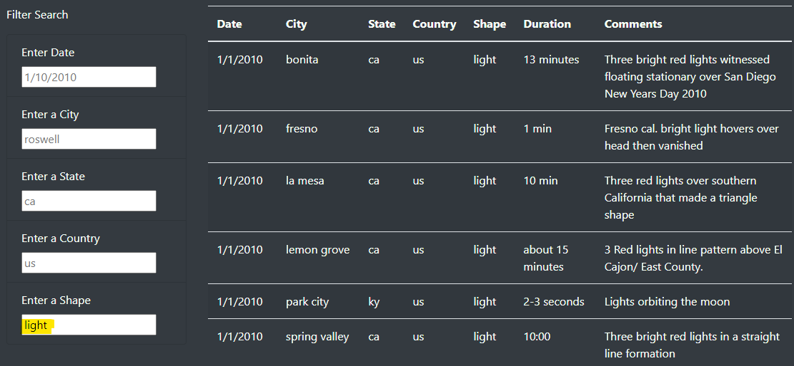
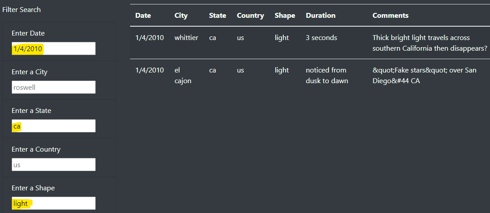

# UFOs

## Overview of the Project
Dana is building a website on UFO sighting. The inital webpage only allows for one filter criteria. Upon entering the critiera, a user would have to click on a button to return the filter data. This challenge is focused on two parts to make the webpage more dynamic in many ways. First, create filters for multiple criteria at the same time and secondly, the return filter data need not wait on a button to filter the data. 

## Results
In order to create multiple criteria, the fields need to be created in the HTML file. Creating the function "updateFilters()" within our app.js file allows for the intake of the filter criteria to be implemented. Using the new key-value (filterID-newValue) filter pairs, the data table can be recreated. This satisfies the multiple criteria part. Using d3.selectAll().on("change", ) allows for the table to filter as soon as the filter criteria is complete. This completes the two part challenge. Below are screenshots of what the filters look like.

| Original Table without Filters |
| :---: |
|  |

| Filtered Table with one criteria |
| :---: |
|  |

| Filtered Table with multiple criteria |
| :---: |
|  |

## Summary
Overall, the webpage suits and statisfies what Dana was looking to do with the data. This is a great start to the webpage with many additions left to be added for enhancement. Here are some considerations for further enhancements:
- create dynamic response to various screen sizes. Currently, the website is not suited for mobile devices and the web components do not resize for easy viewing.
- create charts and graphs to track the number of sightings and its frequency. Currently, there are many datapoint that insights UFO sightings but users don't know how many total and how many per city/state/country.

Adding additional details would help users understand the frequency of UFO sighting and can contribute to their decision making about whether UFOs are real or not. 
